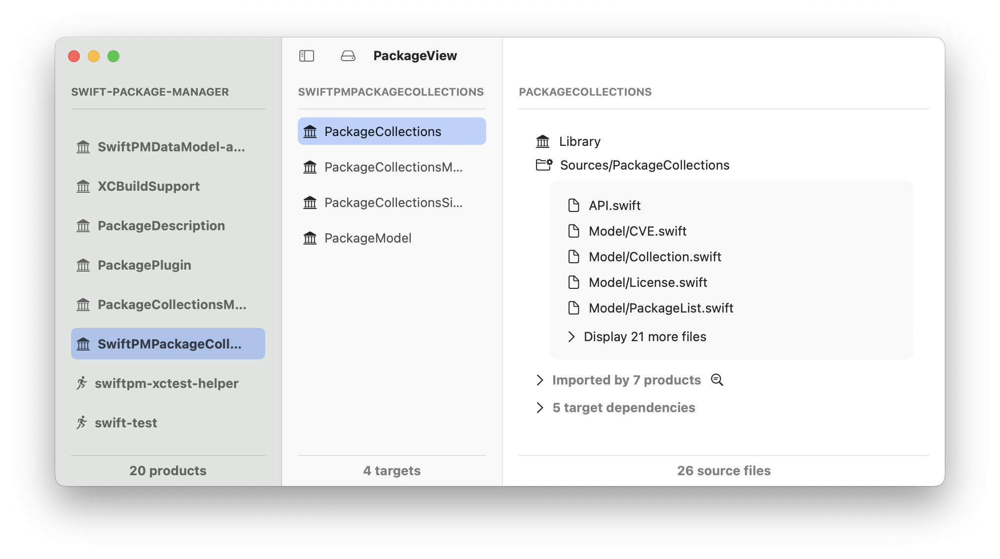

# PackageView

PackageView reads Package.swift files and displays the information in a human-friendly UI.

Start the app, choose a Swift package folder — the app displays three column layout:

 - 1st column lists the available products
 - 2nd column lists the targets in a selected product
 - 3rd column displays the data for a selected target like source files, dependencies, and product memberships.

Click a file in the file list to open it in your default editor.

Click a product or target to select it in the navigation.

**NB**: This is just a prototype, it's not optimized or architected.